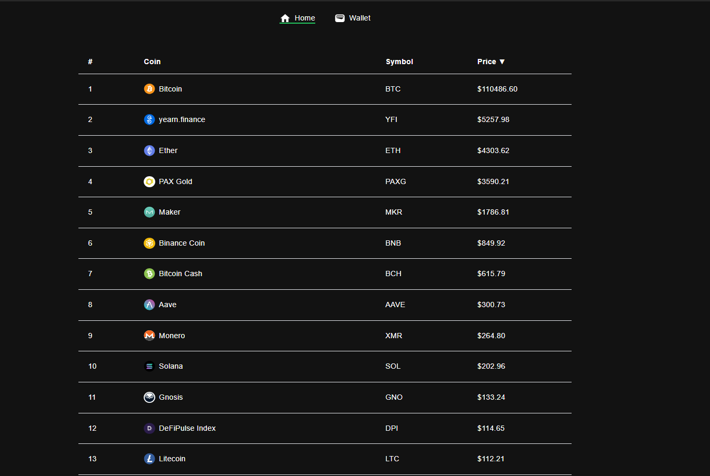
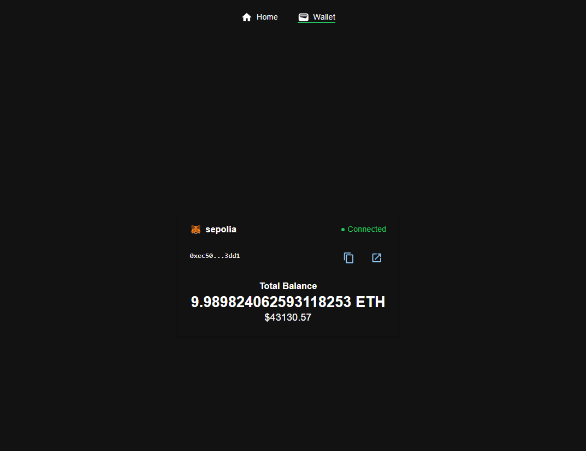

# Frontend Challenge :muscle:

Develop a decentralized application that serves as a simple price widget for [Energiswap](https://app.energiswap.exchange).

The dApp should have 2 tabs:
- Home (display tokens)
- Wallet

## Flow

**Home**



When the homepage loads, it should display tokens in a table sorted by price.

Header columns:
- Icon (see the attached archive)
- Ticker Symbol
- Name
- Price in USD (formatted)

_Make sure the columns are sortable._

See Energiswap [API endpoint](https://api.energiswap.exchange/v1/assets) that will help you construct the table.

**Wallet**



When a user clicks on the **Wallet tab** it should open up the wallet page. If Metamask is disconnected, it should
display the `Connect wallet` button. When Metamask is connected, it will display:
- Cryptocurrency amount
- USD value

_Make sure all numbers are formatted, and switching between Metamask accounts works as expected._

**EXTRA**

Create a toggle button in the right top corner should a user wish to switch between the dark and light themes.

## Running the App

The app should run by executing the following commands:
```sh
yarn
yarn start
```
